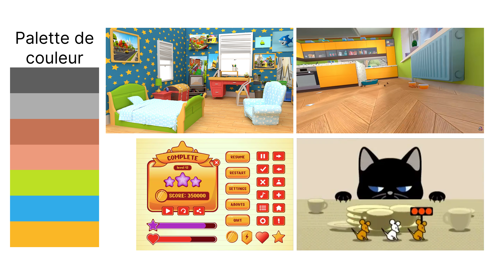
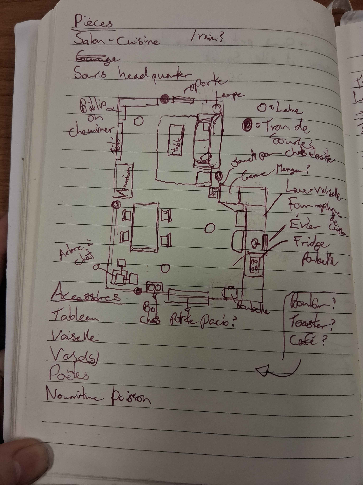
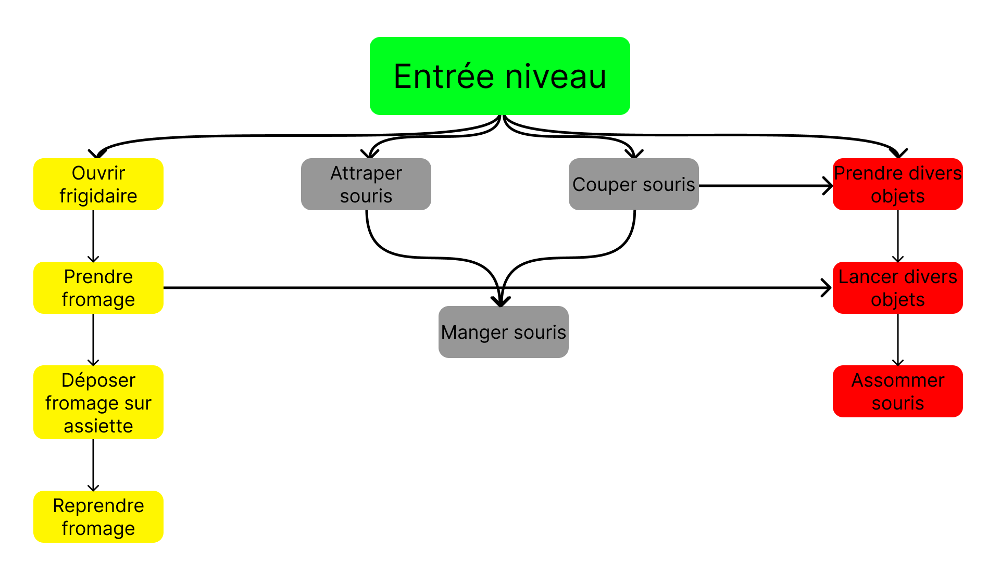

# guilbault_raymond-janvier_tp3_582-401mo
Projet 3 du cours de Réalité Mixte en équipe avec Vicky Raymond-Janvier

# Description projet
**Résumé :** Un chat doit chasser des souris.

**Description :** Le joueur incarne un chat dans une maison avec des adultes absents. Avant leur retour (minuteur du niveau de base), le chat doit manger toutes les souris dans la maison.

Il doit prendre les souris ou les couper pour ensuite les manger. Pour s'aider, il peut prendre des objets divers (pelottes de laine, cadavres de souris, contenants, etc.) et les lancer sur les souris pour les assomer temporairement. Il peut aussi prendre du fromage dans le frigidaire et le déposer sur des assiettes pour attirer les souris. Cependant, si le fromage reste sorti trop longtemps il moisit et devient inutilisable.

Si les humains arrivent et que les souris n'ont pas toutes été éliminés, le joueur perd. (Mauvaise fin)
Si toutes les souris ont été éliminés, le joueur gagne. (Bonne fin)

Derrière la télévision se trouve un trou menant au «palais des souris». Le joueur, une fois à l'intérieur, doit lancer des bombes 10 fois sur le roi souris pour pouvoir obtenir une clé permettant de les désactiver avant qu'elles n'explosent (minuteur de ce niveau).

# Moodboard
## Visuel

## Audio

# Carte de l'environnement

# Schéma D'interactivité

